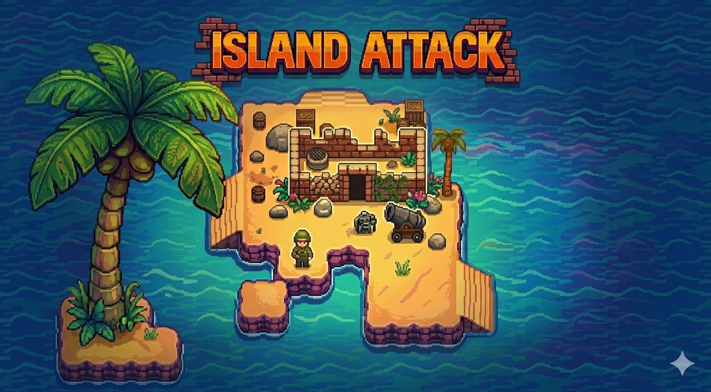

# Island Attack

A top-down pixel-art action game built in Rust inspired by Jackal for NES. Drive a jeep across enemy-held islands, destroy barracks, rescue POWs, and reach the goal to complete each mission.

## Play

[Play in your browser](https://mronge.github.io/IslandAttack/) (WebAssembly) or build natively for macOS.

## Controls

- **WASD / Arrow Keys** -- Move
- **Space** -- Fire
- **R** -- Retry mission
- **Tab** (hold) -- Show HUD stats

## Building

### Native (macOS)

```
cargo run --release
```

### Web (WASM)

```
./scripts/build_web.sh
cd web/dist && python3 -m http.server 8000
```

Pushes to `main` automatically deploy to GitHub Pages.

## Libraries

- [macroquad](https://github.com/not-fl3/macroquad) -- Cross-platform game framework (rendering, input, audio, WASM support)

## Artwork

Artwork, music and sound effects were created with AI

- Artwork: Pixellab.ai with manual edits in Aseprite
- Music: Google Lyria 3
- Map Editor: Sprite Fusion

## License

MIT License